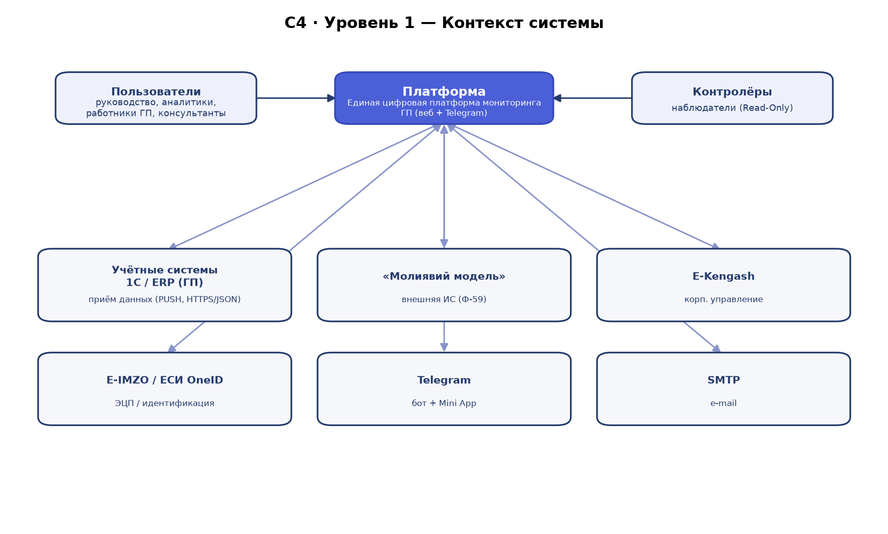
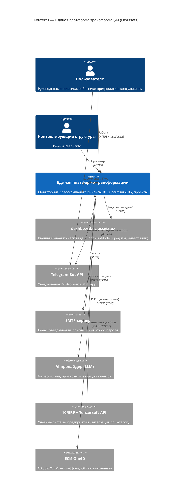
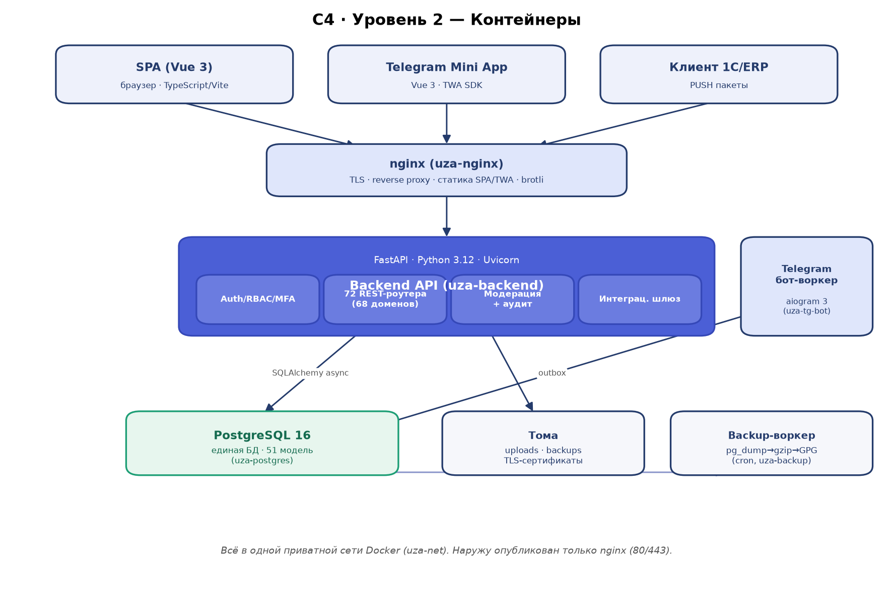
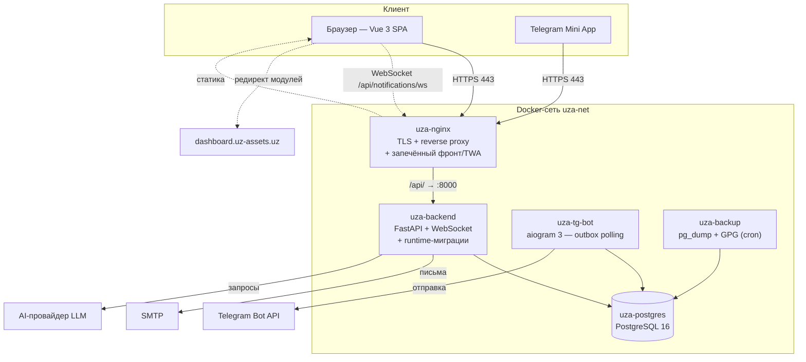

# Архитектура

> Снимок кода: коммит `c9f29f3`, ветка `master`, 2026-07-21.
> Платформа: «Единая платформа трансформации» (внутр. UzAssets) — мониторинг
> 22 государственных компаний Узбекистана.

## C4-модель

### Уровень 1 — Контекст



Пользователи (руководство обществ, отраслевые аналитики, работники предприятий,
консультанты) и контролирующие структуры (режим Read-Only) работают с платформой
через веб-браузер и Telegram-бот. Наружу платформа взаимодействует с:

- **внешним аналитическим дашбордом** `dashboard.uz-assets.uz` — на него уходят
  редиректы модулей «Финансовая модель», «Кредитный портфель», «Инвест-проекты»
  (локальные Vue-реализации удалены как мёртвый код, см. ниже);
- **Telegram Bot API** — доставка уведомлений, привязка аккаунта, MFA-ссылки,
  Telegram Mini App (TWA);
- **SMTP** — e-mail-уведомления, приглашения, восстановление пароля;
- **AI-провайдером** (vendor-agnostic LLM-эндпоинт из окружения) — чат-ассистент,
  прогнозы, импорт документов;
- **интеграционным API внешних систем** (1С/ERP предприятий, Tenzorsoft FinModel/
  Treasury/Spravochniki) — машиночитаемый каталог в `docs/integration/` (пока
  спецификация для будущего извлечения данных, не активный runtime-коннектор);
- **ЕСИ OneID** — OAuth2/OIDC-скаффолд в backend, по умолчанию выключен
  (`ONEID_ENABLED=false`).



### Уровень 2 — Контейнеры



Оркестрация — Docker Compose (`backend/docker-compose.yml`). Профиль `production`
дополнительно поднимает nginx (TLS-edge) и backup-воркер.

| Контейнер | Технология | Назначение |
|---|---|---|
| `uza-nginx` | nginx (multi-stage образ) | TLS-терминация, reverse proxy `/api/ → backend:8000`, отдача **запечённого** фронт-бандла и TWA-бандла |
| `uza-backend` | FastAPI / Python 3.12 / Uvicorn | REST API, WebSocket, бизнес-логика, runtime-миграции, интеграции |
| `uza-postgres` | postgres:16-alpine | Единая база данных (141 таблица в `public`) |
| `uza-tg-bot` | aiogram 3 (outbox-воркер) | Доставка уведомлений (polling очереди-outbox), MFA-ссылки, callbacks |
| `uza-backup` | dcron + pg_dump + gzip + GPG | Периодические шифрованные резервные копии (по умолчанию каждые 6 ч, retention 30 дней) |

Отдельных контейнеров `uza-frontend` и `uza-frontend-twa` **больше нет**: Vue-бандл
и Telegram Mini App собираются прямо в образ nginx многоступенчатым Dockerfile
(stage node:20 + `vite build` → stage nginx static). Это экономит два контейнера,
RAM и сетевой хоп; для выката фронта пересобирается образ nginx.

Все контейнеры — в одной приватной сети Docker (`uza-net`); наружу опубликован
только nginx (порты 80/443). PostgreSQL слушает лишь внутреннюю сеть (`expose: 5432`,
не публикуется на хост). Код backend смонтирован **read-only** (`./backend:/app:ro`),
запись — только в именованные тома (`backend_uploads`, `backups`, `postgres_data`).



### Уровень 3 — Компоненты (backend)

Слоистая (10-слойная в терминах паттерна `fastapi-structure`) архитектура; поток
запроса — тонкий роутер без прямого доступа к БД:

```
HTTP → route (тонкий) → dependencies (аутентификация, RBAC-права, scope)
     → service (бизнес-логика) → unit of work (транзакция)
     → repository (SQLAlchemy async) → PostgreSQL
```

В коде: **72 роутера** (`backend/app/api/routes/*.py`) и **~68 сервисных пакетов**
(`backend/app/services/*`). Каждый роутер несёт собственный внутренний префикс;
`main.py` монтирует их как есть, без override `/api` (на проде префикс `/api`
даёт nginx + `API_ROOT_PATH=/api` для Swagger).

Ключевые сквозные компоненты:

- **Auth / RBAC v3 / MFA** — пароль + второй фактор; ролевая модель с повторной
  серверной проверкой прав на каждом запросе; ограничение области видимости
  (scope) по предприятиям/секторам.
  - **Privilege-ceiling (упрочнение, снимок c9f29f3):** на всех путях выдачи прав
    и ролей (`create_user`, `update_user`, `upsert_user_membership`,
    `set_group_members`, `set_group_permissions`, `create_role`,
    `update_role_permissions`) добавлены проверки-«потолок» через
    `_ensure_group_membership_within_ceiling` и
    `_ensure_assigned_scope_within_ceiling`
    (`backend/app/services/rbac_v3/service.py`). Закрыта вертикальная
    самоэскалация (нельзя выдать себе/другим `admin`/`admin.*`) и горизонтальная
    (per-company/sector scope) — scoped-администратор не может расширить область
    сверх собственной.
- **Модерация** — изменения ограниченных пользователей ставятся в очередь на
  согласование (`gate_or_apply` → apply-обработчик по модулю).
- **Аудит** — журнал в режиме «только добавление» (HMAC-целостность, роль
  `uza_app` без UPDATE/DELETE на `audit_log`); логирование действий и просмотров.
  `PATCH /me` self-set `organization_id` валидирует существование компании и
  пишет аудит-запись.
- **Интеграционный шлюз** — приём данных из 1С/ERP, реестр внешних API
  (`/external-apis`), программные ключи (`/api-keys`), исходящие webhooks
  (`/webhooks`), диспетчер кастомных API (`/api/v1/custom`).
- **AI-движок** — vendor-agnostic; тиры моделей (fast/balanced/deep) из окружения.
  В снимке c9f29f3 чат больше не 400-ит на новых моделях (напр. Opus 4.8): и
  `complete_once`, и `stream_chat_with_tools` при 400 «temperature deprecated»
  убирают параметр и повторяют запрос (`backend/app/services/ai_service.py`).
- **Runtime-миграции** — идемпотентные `ADD COLUMN ... IF NOT EXISTS` при старте
  backend (`app/core/runtime_migrations.py`), в дополнение к Alembic.

Домены (сервисные пакеты): dashboard, exec_dashboard/exec-overview, financials
(ifrs/nsbu/hlf), business_plan, kpi, credit (scenario/portfolio), invest_projects,
unit_cost, production, procurement/forensic, ratings, esg, governance, consultants,
projects/tasks, pmo, reporting/report-wizard, notifications, presence, moderation,
audit, rbac_v3, companies, knowledge (RAG), ai и другие.

## Асинхронность и фоновые задачи

**Выделенного брокера очередей нет** — в коде и compose отсутствуют Redis, RabbitMQ,
Celery, Kafka. Асинхронная обработка построена на трёх механизмах:

- **FastAPI `BackgroundTasks`** — короткие пост-обработки внутри процесса backend
  (рассылка уведомлений, письма, аудит-троттлинг).
- **Таблица-outbox + polling телеграм-бота** — уведомления кладутся в БД, `uza-tg-bot`
  опрашивает её (`OUTBOX_POLL_SEC=2.0`, батч 10, ретраи до 5) и доставляет.
- **systemd-таймеры на VM** — автодеплой (`ops/vm-autodeploy/`, каждые 2 мин) и
  cron внутри `uza-backup` (pg_dump по расписанию). Presence-«онлайн» — не
  WebSocket, а polling: клиент шлёт `POST /presence/heartbeat`.

WebSocket применяется точечно: `/notifications/ws/{token}` (реалтайм-уведомления)
и WS company-library (совместное редактирование карточек компаний).

## Стратегия ветвления

Основная ветка — **`master`**: единственная защищённая долгоживущая ветка, всегда в
рабочем (деплоящемся) состоянии; `origin` на GitHub. На момент снимка активна
фича-ветка `feat/financials-ux-overhaul`.

Процесс:

- работа ведётся в короткоживущих feature-ветках `feat/<кратко>` от `master`;
- слияние в `master` через Pull Request с ревью; прямые пуши в `master` не приветствуются;
- **`master` — источник автодеплоя:** merge/push в `master` разворачивается на VM
  автоматически — VM сама тянет `origin/master` по systemd-таймеру (pull-based,
  см. ниже и INFRASTRUCTURE.md);
- hotfix — ветка `hotfix/<кратко>` от `master`, ускоренное ревью и слияние.

Гейты качества перед слиянием:

- backend: `python -m py_compile` изменённых модулей; тесты `pytest` (testcontainers,
  схема через `Base.metadata.create_all` + seed, не Alembic);
- frontend: `npx vite build` — эталонная прод-сборка (именно так строит образ nginx).
  `npm run build` (`vue-tsc -b && vite build`) и strict-режим `vue-tsc` **не** гейтуют:
  падают на десятках пред-существующих type-ошибок.

### Автодеплой (pull-based)

Входящий SSH (порт 22) на VM периодически режется фаерволом, поэтому push-деплой
ненадёжен. Решение — VM тянет изменения сама (`ops/vm-autodeploy/deploy.sh`, запуск
по `uza-autodeploy.timer` каждые 2 мин):

1. `git fetch origin master`; если `HEAD == origin/master` — выход (идемпотентно);
2. сохранение окружение-специфичного `backend/jwt_public.pem` перед `git reset --hard`
   (иначе «Signature verification failed» после MFA);
3. `git reset --hard origin/master`, восстановление ключа;
4. `docker compose ... build nginx` (пересборка запечённого фронта) + `up -d
   --force-recreate nginx`;
5. `restart backend` — на старте прогоняются runtime-миграции и seed.

## Технологии (стек)

### Backend (`backend/requirements.txt`)

| Слой | Средство (пинованная версия) |
|---|---|
| Каркас API | FastAPI 0.115, Uvicorn 0.32 (`[standard]`), python-multipart |
| ORM / драйверы | SQLAlchemy 2.0.35 (async), asyncpg 0.29, psycopg 3.2 |
| Миграции | Alembic 1.13 + идемпотентные runtime-миграции |
| Валидация / настройки | Pydantic 2.9, pydantic-settings, email-validator |
| Аутентификация / крипто | PyJWT 2.9 (RS256, обязательный `kid`), bcrypt 4.2, cryptography 43 (Fernet) |
| Ограничение частоты | slowapi 0.1.9 |
| HTTP-клиент | httpx 0.27 |
| Обработка данных / импорт | pandas 2.2, openpyxl 3.1, python-dateutil |
| RAG / парсинг документов | pypdf 5.1, python-docx 1.1 |
| Telegram-баннеры | Pillow 11 |
| Файловое хранилище | aiobotocore 2.15 (S3-опция; LOCAL по умолчанию) |
| Логирование | structlog 24, orjson |
| Наблюдаемость | sentry-sdk 2.18 (opt-in), prometheus-client 0.21 (`/metrics`) |
| СУБД | PostgreSQL 16 |

Telegram-бот (`bot/`) — aiogram 3.

### Frontend (`frontend/package.json`)

Vue 3.5 + TypeScript 5.6 + Vite 5.4 + Pinia 2.2 + Vue Router 4.4. Графики —
Chart.js 4.4 / vue-chartjs. HTTP — axios. Санитайзинг — DOMPurify. Экспорт/импорт
Excel — xlsx (SheetJS). Шрифты — Geist (self-hosted `@fontsource-variable`).
Тесты — Vitest + @vue/test-utils, e2e — Playwright. Стили — Tailwind 3.4.
Telegram Mini App — отдельная Vue-сборка, тоже запекается в образ nginx
(build-stage `twa-builder`, отдаётся `location /twa/`).

### Инфраструктура

nginx (multi-stage образ, TLS), Docker / Docker Compose, Ubuntu 24.04 LTS.

## Интеграции

### Клиент ↔ сервер

Взаимодействие фронтенда с backend — **REST API** (JSON) под префиксом `/api/`
(nginx проксирует `/api/ → backend:8000`). Аутентификация — JWT (RS256) в заголовке
`Authorization: Bearer`, обязательный `kid` в заголовке токена (без `kid`
`decode_token` отвергает токен). Основные группы эндпоинтов (72 роутера):

| Область | Префиксы (примеры) |
|---|---|
| Аутентификация / MFA / OneID | `/auth/*`, `/auth/forgot-password`, `/auth/oneid`, `/mfa/*` |
| Пользователи, роли, права | `/rbac/v3/*`, `/users/*`, `/admin/users/*` |
| Компании / администрирование | `/companies/*`, `/companies-admin/v2`, `/sectors-admin/v2` |
| Финансы | `/financials/*`, `/finmodel/*`, `/ifrs-report-history/*` |
| Бизнес-план / КПЭ / производство | `/bp/*`, `/kpi/*`, `/production/*`, `/unit-cost/*` |
| Кредиты / сценарии / субсидии | `/credit-portfolio/*`, `/credit-scenario/*`, `/scenarios/*`, `/subsidies/*` |
| Инвест-проекты | `/invest*` (backend живой; фронт-модуль редиректит наружу) |
| Закупки / форензик | `/procurement/*`, `/forensic/*` |
| Рейтинги / ESG / КУ | `/esg/*`, `/governance/*` |
| Проекты / задачи / PMO / доски | `/projects/*`, `/pmo/*`, `/calendar/*`, `/status-updates/*` |
| Консультанты / партнёры | `/consultants/*`, `/partners/*` |
| Отчёты / поиск | `/report-wizard/*`, `/search/*`, `/overview-matrix/*` |
| Уведомления / присутствие | `/notifications/*`, `/presence/*`, `/watches/*` |
| Модерация / аудит | `/moderation/*`, `/admin/audit/*` |
| Дашборды / обзор | `/dashboard/*`, `/dashboard/executive/*`, `/exec-overview/*` |
| Вложения / знания (RAG) | `/attachments/*`, `/knowledge/*` |
| AI-ассистент | `/ai/*` |
| Интеграционный шлюз | `/external-apis/*`, `/api-keys/*`, `/webhooks/*`, `/api/v1/custom/*`, `/custom-api/*` |
| Системная конфигурация / мониторинг | `/system-config/*`, `/monitoring/*`, `/admin/db`, `/admin/tls`, `/admin/storage` |
| Telegram / рассылки | `/bot/*`, `/tg-banners/*`, `/broadcasts/*`, `/admin-broadcasts/*` |

**WebSocket:** `/api/notifications/ws/{token}` — реалтайм-уведомления;
WS company-library — совместное редактирование карточек. **Presence** — не WS, а
polling (`POST /presence/heartbeat`).

Полная спецификация — OpenAPI (`/api-catalog/openapi.json`, Swagger UI `/api/docs`
при `ENABLE_DOCS_IN_PRODUCTION`).

### Внешний дашборд (редирект модулей)

Локальные Vue-модули **FinModel**, **Credit Portfolio**, **Invest Projects** (а также
`FinModelUapV1`, кредит/эконом-блоки ExecDash, фабрикованная карточка «стандарты»,
скрытые UI-блоки) в снимке c9f29f3 **удалены как мёртвый код**. Роуты сохранены как
render-null-заглушки (`component: { render: () => null }`) с `beforeEnter`, который
редиректит на внешний дашборд (`frontend/src/router/index.ts`):

| Роут | Внешний адрес |
|---|---|
| `finmodel` | `dashboard.uz-assets.uz/soe-dashboard/finmodel-3?...` |
| `credit-portfolio` | `dashboard.uz-assets.uz/soe-dashboard/credits?tab=overview` |
| `invest-projects` | `dashboard.uz-assets.uz/soe-dashboard/investments?view=portfolio` |

Редирект был и раньше (`beforeEnter` с 2026-05-23) — удалён только мёртвый локальный
код за заглушкой, поведение для пользователя не изменилось. Соответствующий
**backend** (`credit_scenario`, `invest_projects`) — **живой**: потребляется
`CreditNagruzkaTab` в `/system-config` и ExecDash; не удалялся.

### Внешние системы

| Система | Направление | Транспорт / статус |
|---|---|---|
| `dashboard.uz-assets.uz` | редирект модулей (наружу) | HTTPS, активно |
| Telegram Bot API | уведомления, MFA-ссылки, callbacks, TWA | Bot API, активно (`uza-tg-bot`) |
| SMTP | e-mail-уведомления, приглашения, сброс пароля | SMTP, активно (`app/services/email`) |
| AI-провайдер (LLM) | чат, прогнозы, импорт документов | HTTPS/JSON, активно (ключ из окружения) |
| 1С/ERP + Tenzorsoft (FinModel/Treasury/Spravochniki) | приём данных (PUSH) | HTTPS/JSON — каталог `docs/integration/`, спецификация (не активный runtime-коннектор) |
| ЕСИ OneID | идентификация | OAuth2/OIDC — backend-скаффолд, `ONEID_ENABLED=false` |

Каталог интеграционных сервисов 1С/ERP оформлен машиночитаемо (`docs/integration/`,
по O'zMSt 151:2024): реестр услуг, описание интерфейсов, SLA + JSON-спецификации
(`finmodel.endpoints.json`, `treasury.endpoints.json`, `spravochniki.endpoints.json`,
`measurement-units.json`). Владелец целевого API — Tenzorsoft (Java/Spring),
это отдельная система; интеграция — задел на будущее извлечение данных.
