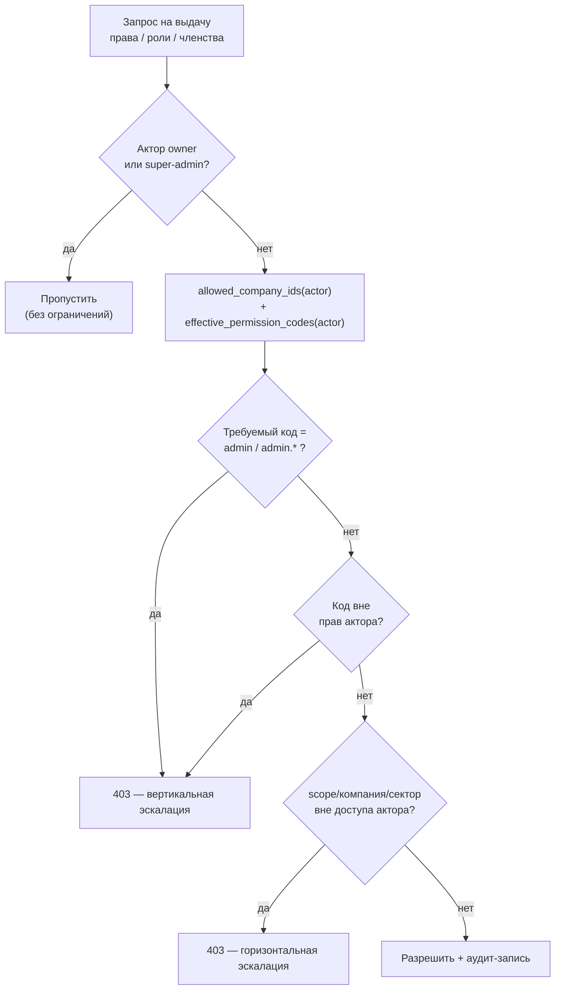

# Соответствие стандартам кибербезопасности Республики Узбекистан

Карта соответствия реализованных в платформе мер требованиям государственных
стандартов (O'z DSt / O'zMSt). Статусы: **Реализовано** (мера в коде/инфраструктуре),
**Частично** (каркас/схема, требует ввода в эксплуатацию), **Организационное**
(вне прикладного ПО — регламенты, регистрация ИС, аттестация).

> **Снимок:** ветка `master`, коммит `c9f29f3`, дата 2026-07-21.
> Прикладной уровень (аутентификация, доступ, криптография транспорта/полей,
> целостность аудита, безопасность хранения) закрыт средствами платформы;
> регуляторные пункты (нацкрипто/СКЗИ, боевой ЕСИ OneID, обязательный MFA,
> ПДн, аттестация СУИБ) остаются организационно-регуляторным гэпом и
> выполняются при вводе ИС в эксплуатацию.

## Идентификация и аутентификация

| Стандарт | Требование | Статус | Реализация в платформе |
|---|---|---|---|
| O'zMSt 149-2024 (п. 6.8) | Аутентификация заявителей через национальную систему идентификации | Частично | Скаффолд ЕСИ / One ID (OAuth2/OIDC, Authorization Code, подписанный `state`), `backend/app/services/oneid_service.py`. По умолчанию `ONEID_ENABLED=False` → все операции возвращают 503, текущий вход логин/пароль не затрагивается; активируется после регистрации ИС и выдачи `client_id/secret` |
| O'zMSt 841-2026 (п. 5.2.4) | Усиленная (повторная) аутентификация для критичных операций | Реализовано | Механизм step-up: критичные действия требуют «сильной» аутентификации не старше 10 минут (`last_strong_auth_at`) |
| O'z DSt ISO/IEC 9798 | Механизмы аутентификации | Реализовано | Пароль + второй фактор; MFA (6-значный код, срок 5 мин, независимые каналы Telegram/e-mail), резервные коды, блокировка после 5 попыток |
| — | Парольная политика | Реализовано | bcrypt (cost 12), мин. длина 12, история 5, срок 90 дней, запрет распространённых/последовательностей |
| — | Целостность JWT | Реализовано | RS256, **обязательный `kid`** в header (токены без `kid` отвергаются), белый список алгоритмов; отзыв всех сессий при сбросе пароля/деактивации |

> MFA поддержан на уровне механизма и включается per-user/политикой, но
> **обязательный MFA для всех** ещё не форсируется системно — это регуляторный
> гэп (см. открытые пункты), а не отсутствие функции.

## Управление доступом

| Стандарт | Требование | Статус | Реализация |
|---|---|---|---|
| O'z DSt ISO/IEC 27002 | Управление доступом (RBAC) | Реализовано | Ролевая модель RBAC v3 (`app/api/routes/rbac_v3.py`, `/rbac/v3/*`); deny > allow; серверная проверка прав на каждом запросе; область видимости по предприятиям/секторам (per-company/sector scope, `core/access.py`); ключи API со scopes |
| O'z DSt ISO/IEC 15408 | Классы FIA/FDP/FMT | Реализовано | Идентификация/аутентификация, защита данных пользователя, управление безопасностью — по ролям и scope |
| O'z DSt 1987-2018 | Разграничение и наименьшие привилегии | Реализовано | **Privilege-ceiling** на всех путях выдачи прав/ролей: не-owner не может выдать (в т.ч. себе) право/scope сверх собственного |

### Упрочнение RBAC (privilege-ceiling и owner-guard)

По итогам аудита RBAC закрыты вертикальная (эскалация до `admin`/`admin.*`)
и горизонтальная (выход за свой per-company/sector scope) самоэскалация
scoped-администратора. Потолок применяется на **всех** путях выдачи прав,
ролей и членства:

- `create_user`, `update_user` — назначаемый `organization_id`/`allowed_sectors`
  проверяется хелпером `_ensure_assigned_scope_within_ceiling` (в пределах
  доступа актора);
- `upsert_user_membership`, `set_group_members` — вступление в группу проверяется
  `_ensure_group_membership_within_ceiling` (и `company_id` группы, и её
  `GroupPermissionGrant` не должны нести право/scope сверх актора);
- `set_group_permissions`, `create_role`, `update_role_permissions` — нельзя
  вложить в грант/роль `admin`/`admin.*` или коды сверх собственных.

Owner-guard: `_ensure_can_manage_target` не даёт не-owner сбросить пароль или
деактивировать учётную запись OWNER (закрытие захвата аккаунта). `is_owner`
переключается только owner'ом; запрет деактивации/понижения самого себя.

`PATCH /me` (self-set `organization_id`) — валидация существования компании
и аудит-запись (коммит `1042171`).

## Криптография

| Стандарт | Требование | Статус | Реализация |
|---|---|---|---|
| O'zMSt 270-2024 / 285-2024 | Национальные криптоалгоритмы / СКЗИ | Частично | Seam криптопровайдера (`core/crypto_provider.py`): `CRYPTO_PROVIDER=default\|national` (по умолчанию `default`). Провайдер `default` = встроенные Fernet (AES-128-CBC+HMAC)/SHA-256/HMAC-SHA256 — **не сертифицированное СКЗИ и не нацалгоритмы**. Провайдер `national` = адаптер к внешнему сертифицированному модулю (E-IMZO / PKCS#11 / HTTP-шлюз ГЦП), методы по умолчанию поднимают `NotImplementedError`. Боевое подключение — организационное |
| O'z DSt 2814 / 2815 | ЭЦП / функция хэширования | Частично | Каркас применения ЭЦП (E-IMZO) для юридически значимых действий; хэширование секретов |
| O'z DSt ISO/IEC 27002 | Применение криптографии | Реализовано | TLS + HSTS (1 год, preload); JWT RS256 с обязательным `kid` и белым списком алгоритмов; шифрование чувствительных полей (Fernet, `core/encryption.py`); проверка срока TLS-сертификата |

> Seam аддитивный: он **не** переключает текущие вызовы крипты автоматически.
> Перевод на СКЗИ = поэтапная маршрутизация точек вызова (`encryption.py`,
> `password.py`, `audit_chain.py`) через `get_crypto_provider()` при
> подключённом сертифицированном модуле.

## Целостность, неотказуемость, аудит

| Стандарт | Требование | Статус | Реализация |
|---|---|---|---|
| O'z DSt ISO/IEC 13888 | Неотказуемость | Реализовано | Журнал аудита «только добавление» с HMAC-цепочкой целостности (`core/audit_chain.py`); фиксация актора/времени |
| — | Полнота журналирования | Реализовано | Логирование действий и просмотров (с троттлингом), API `/audit/by-user`, UI «по людям» с графиками. Ключевые события RBAC (create/update role, reset_password, membership, self-set organization_id) пишут аудит-записи |
| O'zMSt ISO/IEC 27007-2025 | Аудит СУИБ | Организационное | Журнал действий пригоден для разбора; сама процедура аудита СУИБ — регламент заказчика |
| — | Модерация изменений | Реализовано | Согласование изменений ограниченных пользователей (очередь → apply-обработчик) |

## Безопасность хранения и непрерывность

| Стандарт | Требование | Статус | Реализация |
|---|---|---|---|
| O'zMSt ISO/IEC 27040-2026 | Безопасность хранения данных | Реализовано | Резервные копии `pg_dump` → GPG-шифрование → SHA-256-манифест; retention 30 дней; отказ писать незашифрованный архив. Контейнер `uza-backup` (ежедневный бэкап) |
| O'z DSt ISO/IEC 27031-2016 | Готовность к непрерывности (BC/DR) | Частично | Резервное копирование + процедура восстановления (`docs/handoff/RUNBOOK.md`); формальный план BC/DR — организационное |

## Защита ГИС, интеграция, жизненный цикл

| Стандарт | Требование | Статус | Реализация |
|---|---|---|---|
| O'z DSt 1987-2018 | Защита государственных информационных ресурсов | Реализовано | Комплекс мер ИБ (см. выше); изоляция БД (`uza-postgres`) во внутренней Docker-сети; контейнеры с `no-new-privileges`/`cap_drop`; код read-only в контейнере |
| O'zMSt 151-2024 / O'z DSt 2590-2012 | Интеграция и взаимодействие ГИС | Реализовано | Каталог интеграционных сервисов (`docs/integration/`: реестр услуг/интерфейс/SLA); REST/JSON, токены, идемпотентность, журнал обменов |
| O'z DSt 1986-2018 | Создание ИС (жизненный цикл) | Реализовано | Разработка/приёмка по стандарту; ТЗ оформлено по нему |
| O'z DSt 1985-2018 | Виды и комплектность документов ИС | Реализовано | Комплект эксплуатационной документации (см. `docs/handoff/`) |

## Персональные данные и ИИ

| Стандарт | Требование | Статус | Реализация |
|---|---|---|---|
| O'zMSt ISO/IEC 29184-2025 | Уведомления о приватности / согласие | Организационное/Частично | ПДн-полей минимум; обработка ПИНФЛ — на стороне сервиса интеграции ЕСИ (One ID); политика/уведомления о приватности — регламент заказчика |
| O'zMSt ISO/IEC 23894-2025 | Управление рисками ИИ | Частично | Модуль ИИ гейтится тремя условиями (право `ai.view` + тумблер `assistant_active` + `ANTHROPIC_API_KEY`); доступ к данным по scope; формальная оценка рисков ИИ — организационное |

## Защита от типовых угроз (прикладной уровень)

- Ограничение частоты запросов (per-endpoint/per-user), ограничение размеров тела и
  загружаемых файлов, проверка типов файлов по содержимому.
- Защита сессий: ограниченный срок, просмотр/завершение активных сессий, немедленное
  прекращение доступа при отключении учётной записи или сбросе пароля (revoke_all_sessions).
- Защита веб-приложения от типовых атак (внедрение кода, подделка запросов) — по
  рекомендациям T 45-194:2007.

## Открытые пункты (для ввода в эксплуатацию — организационно)

Требуют действий заказчика/регулятора, не прикладного кода:

1. **Регистрация ИС** в уполномоченном органе и активация ЕСИ One ID (боевые
   `client_id/secret`, `ONEID_ENABLED=true`) — O'zMSt 149.
2. **Боевое подключение национальной криптографии/СКЗИ** через предусмотренный seam
   (`CRYPTO_PROVIDER=national`) — O'zMSt 270/285.
3. **Обязательный MFA для всех пользователей** — механизм есть, системное
   принуждение (политика/форсирование) — организационное.
4. **Аттестация СУИБ** и формальные регламенты (политика ИБ, план BC/DR, процедуры
   аудита) — ISO 27001/27007/27031.
5. **Политика обработки персональных данных** и уведомления о приватности —
   ISO 29184 и законодательство о ПДн.
6. **Формальная оценка рисков ИИ** — ISO 23894.

Прикладной уровень (аутентификация, доступ с privilege-ceiling и owner-guard,
криптография транспорта/полей, целостность аудита, безопасность хранения) —
закрыт средствами платформы; оставшиеся пункты носят организационно-регуляторный
характер и выполняются при вводе ИС в эксплуатацию.
