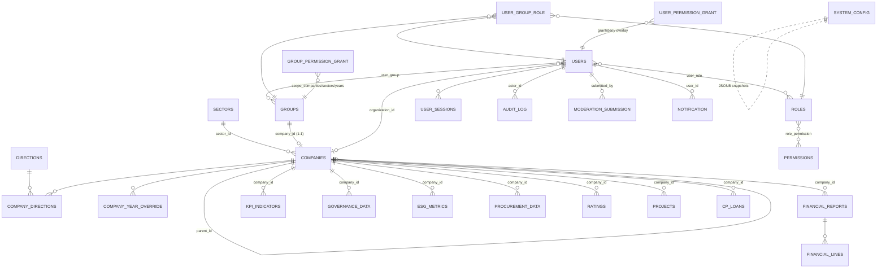

# База данных

> Снимок: коммит `c9f29f3` (ветка `master`), 2026-07-21.
> Часть handoff-комплекта: см. также `ARCHITECTURE.md`, `INFRASTRUCTURE.md`, `RUNBOOK.md`.

СУБД — **PostgreSQL 16** (`postgres:16-alpine`, единая реляционная база `uzassets`).
ORM — **SQLAlchemy 2.0** в async-режиме (драйвер `asyncpg` для приложения,
`psycopg` для Alembic/sync-путей). Все данные приложения живут в одной БД.

- **Всего таблиц (`public`): 141.** Из них 126 объявлены прямыми ORM-моделями
  (`__tablename__`), остальное — таблицы связей «многие-ко-многим» без отдельной
  модели (`user_role`, `role_permission`, `user_group`), таблицы, создаваемые
  runtime-миграциями, и служебная `alembic_version`.
- Postgres слушает **только внутреннюю docker-сеть** `uza-net` (`expose: 5432`),
  на хост порт не публикуется. Доступ снаружи — исключительно через
  `docker compose exec postgres psql`.
- Приложение подключается под ролью наименьших привилегий `uza_app` (DML без
  DDL и без `UPDATE`/`DELETE` по `audit_log`); Alembic — под привилегированной
  ролью (`DATABASE_URL_ADMIN`). При первом запуске/в dev роль может падать в
  исходного `uza`-суперпользователя, если `APP_DB_*` не заданы.

Клон/дамп схемы+данных для передачи — **`database/uzassets.dump`** (PostgreSQL
custom-format, `-Fc`); порядок снятия и восстановления описан в
`INFRASTRUCTURE.md` → «Клон базы данных» (`pg_dump -Fc` / `pg_restore --clean
--if-exists`).

## Домены схемы

Ниже — фактические имена таблиц (по `backend/app/models/`), сгруппированные по
доменам.

| Домен | Таблицы |
|---|---|
| **Компании / орг-структура** | `companies`, `sectors`, `directions`, `company_directions`, `company_year_override`, `year_registry` |
| **Company Library (MDM)** | `field_definitions`, `company_library_tabs`, `company_library_views` (значения полей живут в `companies.custom_data` JSONB или маршрутизируются в модуль-владелец) |
| **Пользователи и доступ (RBAC)** | `users`, `user_sessions`, `roles`, `permissions`, `groups`, `user_role`, `role_permission`, `user_group`, `user_group_role`, `group_permission_grant`, `user_permission_grant` |
| **Аутентификация / 2FA** | `mfa_login_challenge`, `mfa_trusted_ips`, `user_telegram_pref`, `api_key` |
| **Наблюдение / телеметрия** | `entity_watch`, `telemetry_log` |
| **Задачи и проекты** | `projects`, `tasks`, `task_comments`, `task_attachments`, `task_dependencies`, `task_history`, `project_comments`, `project_financial_effects`, `boards`, `board_columns`, `board_cards`, `progress_snapshots`, `notes`, `note_links`, `note_checklist_items` |
| **PMO** | `pmo_charters`, `pmo_sprints`, `pmo_stakeholders`, `pmo_raci`, `pmo_lessons`, `pmo_changes`, `raid_items` |
| **Финансовая отчётность** | `financial_reports`, `financial_lines`, `ifrs_report_history`, `overview_matrix_configs` |
| **Финмодель / бизнес-план** | `finmodel_template_rows`, `finmodel_cell_values`, `finmodel_cell_comments`, `finmodel_scenarios`, `finmodel_macro_global`, `finmodel_macro_company`, `finmodel_year_lock`, `finmodel_audit_log`, `bp_records`, `bp_comments`, `macro_scenarios`, `macro_scenario_overrides` |
| **Кредитный портфель** | `cp_loans`, `cp_payments`, `cp_fx_rates`, `credit_portfolio_scenarios`, `credit_portfolio_loan_scenarios`, `credit_custom_indicators`, `loan_repayments`, `subsidies`, `elasticity_coefficients` |
| **KPI** | `kpi_indicators`, `kpi_managers`, `kpi_comments` |
| **Производство / себестоимость** | снапшоты в `system_config` (JSONB, key-scoped — см. «JSONB-снапшоты») |
| **Закупки (procurement / forensic)** | `procurement_data`, `procurement_contracts`, `procurement_benchmarks`, `procurement_closures`, `product_clusters` |
| **Рейтинги** | `ratings`, `rating_metrics`, `rating_history`, `agency_ratings`, `agency_rating_history` |
| **ESG** | `esg_metrics`, `esg_issues`, `esg_reports`, `esg_notes`, `esg_swot_items`, `esg_maturity_cells`, `esg_years_tracked` |
| **Корпуправление (governance)** | `governance_data`, `governance_raw`, `board_members`, `committee_meetings`, `status_reports` |
| **Консультанты** | `consultants`, `consultant_assignments`, `consultant_imports` |
| **Отчёты** | `report_wizard_configs` |
| **Уведомления / коммуникации** | `notification`, `notification_preference`, `telegram_outbox`, `announcements`, `status_update`, `comments`, `admin_broadcast_template`, `admin_broadcast_dispatch`, `admin_broadcast_ack` |
| **Модерация** | `moderation_submission`, `moderation_comment`, `moderation_rule` |
| **Аудит / история** | `audit_log`, `finmodel_audit_log`, а также `*_history` (`rating_history`, `agency_rating_history`, `ifrs_report_history`, `task_history`) |
| **ИИ / знания** | `ai_config`, `ai_access`, `ai_conversations`, `ai_messages`, `ai_history`, `ai_user_config`, `knowledge_doc`, `knowledge_chunk` |
| **Интеграции** | `external_api`, `custom_api_endpoint`, `integration_partner`, `webhook_subscription`, `webhook_delivery`, `api_key` |
| **Настройки** | `system_config` |

## ER-диаграмма ядра

Ядро схемы = **компании/сектора ↔ RBAC ↔ доменные данные**. Практически все
доменные таблицы привязаны к компании (`company_id` / `organization_id`), а
контур доступа строится на `users` → `groups` (1:1 с компанией) →
`user_group_role` → `roles` → `permissions`, с оверлеями грантов на уровне
группы и пользователя.

> Существующие рендеры C4-диаграмм платформы: `docs/handoff/diagrams/c4_context.png`,
> `docs/handoff/diagrams/c4_container.png` (диаграмма БД-ядра выше — только Mermaid,
> PNG-версии нет).

### Модель RBAC (детально)

- **`users`** — локальная аутентификация (username/email + bcrypt + JWT RS256),
  без внешнего IdP. Поле `organization_id` привязывает пользователя к компании;
  `allowed_sectors` (JSONB) сужает секторальный доступ. `is_owner` — суперфлаг.
  Чувствительные поля (Telegram chat_id, MFA recovery codes, password history) —
  Fernet-шифрованные (`*_enc`/`*_encrypted`).
- **`roles` / `permissions` / `role_permission`** — классическая RBAC-таксономия
  (роль → набор прав; `permission.code` вида `kpi.edit`, `procurement.contract.approve`).
- **`groups`** — с Pack 147 каждая компания имеет 1:1 группу (`company_id`
  UNIQUE); free-form группы (аудит-команда, проект) — `company_id = NULL`.
  Per-company доступ = членство в группе с непустым `company_id`.
- **`user_group_role`** — роль пользователя **внутри** группы (PK
  `user_id + group_id`, одна роль на группу).
- **`group_permission_grant`** — оверлей прав на уровне группы с scope-полями
  `scope_companies` / `scope_sectors` / `scope_years` (JSONB) и `grant_type`
  (`grant`/`deny`) + `expires_at`.
- **`user_permission_grant`** — прямой per-user оверлей (`grant`/`deny`),
  учитывается в `has_effective_permission` / `effective_permission_codes`.

**RBAC-упрочнение (снимок c9f29f3):** privilege-ceiling теперь применяется на
**всех** путях выдачи прав/ролей — `upsert_user_membership`, `set_group_members`,
`create_user`, `update_user`, `set_group_permissions`, `create_role`,
`update_role_permissions`. Реализация — helpers
`_ensure_group_membership_within_ceiling` и `_ensure_assigned_scope_within_ceiling`
в `backend/app/services/rbac_v3/service.py`. Закрыты вертикальная эскалация
(scoped-админ не может выдать себе `admin`/`admin.*`) и горизонтальная
(per-company/sector scope нельзя расширить за пределы собственного «потолка»).
`PATCH /me` с self-set `organization_id` валидирует существование компании и
пишет аудит-запись.

## Очереди и асинхронность

**Выделенного брокера сообщений НЕТ** (ни Redis, ни RabbitMQ/Kafka, ни Celery —
проверено по коду). Асинхронная обработка построена на трёх механизмах:

1. **Транзакционный outbox `telegram_outbox`** (таблица PostgreSQL). Backend
   записывает исходящее сообщение в ту же транзакцию, что и бизнес-данные
   (гарантия «не потеряется при сбое»); отдельный контейнер-воркер `uza-tg-bot`
   **опрашивает** очередь (`OUTBOX_POLL_SEC=2.0`, `OUTBOX_BATCH_SIZE=10`,
   `OUTBOX_MAX_RETRIES=5`) и доставляет их в Telegram. Бот же обрабатывает
   входящие callbacks/линк-токены MFA (polling Telegram API).
2. **In-process asyncio-планировщики**, стартующие в FastAPI-`lifespan`
   (`backend/app/main.py`) и живущие внутри процесса backend:
   `broadcast_scheduler`, `deadline_scheduler`, `snapshot_scheduler`,
   `tls_scheduler`, плюс фоновый цикл верификации HMAC-цепочки аудита
   (`_audit_chain_verifier_loop`). Разовые «fire-and-forget» задачи (fan-out
   уведомлений, комментарии, ingest) запускаются через `asyncio.create_task`
   (22 использования в коде). **FastAPI `BackgroundTasks` в коде не используются.**
3. **`moderation_submission`** — очередь заявок на согласование изменений
   (заявка → рассмотрение модератором → apply-диспетчер модуля применяет диф).

**Уровень инфраструктуры (не приложения):**
- **systemd-таймер** на прод-VM — только для **деплоя** (тянет `origin/master`
  каждые 2 минуты, `ops/vm-autodeploy/`), к рантайм-логике приложения отношения
  не имеет.
- **Контейнер `uza-backup`** — cron внутри контейнера снимает `pg_dump`
  (по умолчанию каждые 6 часов, `BACKUP_SCHEDULE=0 */6 * * *`), gzip → GPG →
  SHA256-манифест, retention 30 дней. (Прежняя формулировка «ежедневный бэкап»
  устарела — по коду это каждые 6 часов; шифрование GPG обязательно, без
  `BACKUP_GPG_RECIPIENT` бэкап намеренно отказывается писать.)

## JSONB-снапшоты в `system_config`

Ряд «свободно-структурированных» модулей хранит данные не отдельными таблицами,
а как **JSONB-снапшоты в `system_config`** (`key` UNIQUE, `value` JSONB):

- **Forensic-закупки** — снапшот загруженного «Свода».
- **Производственные показатели** — `raw_snapshot.productionData` (вкладка
  Бизнес-плана, период h1/h2/annual; темп/исполнение считаются в сервисе, а не
  берутся из файла).
- **Удельная себестоимость** — period-keyed JSONB (нормы расхода → перерасход/
  экономия; live-обновление только для USD/золота).
- Прочие системные настройки/тумблеры (в т.ч. `assistant_active` для ИИ).

Такой подход даёт вариативность структуры без миграций схемы; цена — данные не
нормализованы и джойнами не адресуются (только по `key`).

## Целостность и особенности

- **Аудит `audit_log`** — append-only, tamper-evident: HMAC-цепочка
  `prev_hash → entry_hash` (секрет в `audit_hmac.key`), фоновый верификатор
  цепочки. Каждый значимый запрос пишет строку через `AuditLoggerMiddleware`
  (`action`, `module`, `entity_*`, HTTP-контекст, `diff`/`payload`, `ip_address`
  типа `INET`). Хранение — `AUDIT_RETENTION_DAYS=1825` (≥5 лет). Роль `uza_app`
  не имеет `UPDATE`/`DELETE` на этой таблице.
- **История изменений** ключевых сущностей — отдельные `*_history` таблицы
  (рейтинги пишутся тремя путями, история ведётся во всех трёх через
  `record_rating_history`).
- **Шифрование полей (Fernet)** — `telegram_chat_id_encrypted`,
  `mfa_secret_encrypted`, `mfa_recovery_codes_enc`, `password_history_enc`.
  Ключ — `fernet.key` / `MFA_ENCRYPTION_KEY`; на старте backend валидирует
  наличие ключа, если есть пользователи с `mfa_enabled=true`.
- **Отчётные периоды** — единый реестр годов `year_registry` (курсы USD/EUR,
  бюджет; живой курс USD в обзоре берётся из реестра, а не из хардкода).
- **Per-year видимость компаний** — `companies.hidden_years` (JSONB) +
  `company_year_override`.
- **Backend-скелеты `credit_scenario` и `invest_projects` — живые** (потребляются
  `CreditNagruzkaTab` в `/system-config` и Exec-Dashboard). Удалён только мёртвый
  **локальный Vue-код** (FinModel, Credit Portfolio, Invest Projects,
  FinModelUapV1) — эти вкладки и раньше редиректили на внешний
  `dashboard.uz-assets.uz`; роуты теперь render-null-заглушки с тем же внешним
  редиректом. Схема БД от этого не изменилась.

## Миграции

Два механизма, оба отрабатывают на **старте backend**:

1. **Alembic** — версионируемые миграции схемы (`backend/alembic/versions/`,
   первая `0001_initial`). Выполняются под привилегированной ролью
   (`DATABASE_URL_ADMIN`).
2. **Runtime-миграции** — идемпотентный self-heal при каждом запуске приложения:
   `backend/app/core/runtime_migrations.py` (+ `runtime_migrations_p741.py`,
   `runtime_migrations_p743.py`). Делают `ALTER TABLE ... ADD COLUMN IF NOT
   EXISTS` / `CREATE TABLE IF NOT EXISTS`, partial-индексы и точечные бэкофиллы/
   сиды (напр. `year_registry` курсы, дефолтные macro-сценарии Base/Opt/Pess).
   Существуют потому, что среда деплоя не всегда может выполнить
   `alembic upgrade head`; безопасны к повторному запуску.

На прод-VM оба применяются автоматически при `restart` backend в рамках
pull-based деплоя (`ops/vm-autodeploy/deploy.sh`).

## Оркестрация БД-контура (прод VM 89.126.221.64)

Docker Compose (`backend/docker-compose.yml`), профиль `production`:

| Контейнер | Образ / сборка | Роль |
|---|---|---|
| `uza-postgres` | `postgres:16-alpine` | БД (том `postgres_data`, только внутр. сеть) |
| `uza-backend` | сборка `./backend` | FastAPI + runtime-миграции + in-process планировщики; код смонтирован `:ro` |
| `uza-tg-bot` | сборка `./bot` | воркер `telegram_outbox` + Telegram callbacks |
| `uza-nginx` | multi-stage (`nginx/Dockerfile`) | TLS-edge + запечённый фронт-бандл (+TWA) |
| `uza-backup` | сборка `./backend/scripts/backup` | cron `pg_dump` → gzip → GPG → SHA256, retention 30д |

Ресурсы VM (замер 2026-07-21 11:30 UTC): Ubuntu 24.04.4 LTS, kernel
6.8.0-124, 2 vCPU, RAM 3.8 GiB (swap 0), диск 38 GB (70% занято, свободно 12 GB),
uptime 26 дней. Нагрузка: load average 0.20/0.23/0.27 (≈10% на 2 ядра),
RAM used 1.5 GiB, buff/cache 1.0 GiB, доступно 2.3 GiB. Лимиты Postgres в
compose: `1.5` CPU / `1G` RAM (reservations `0.25`/256M).
