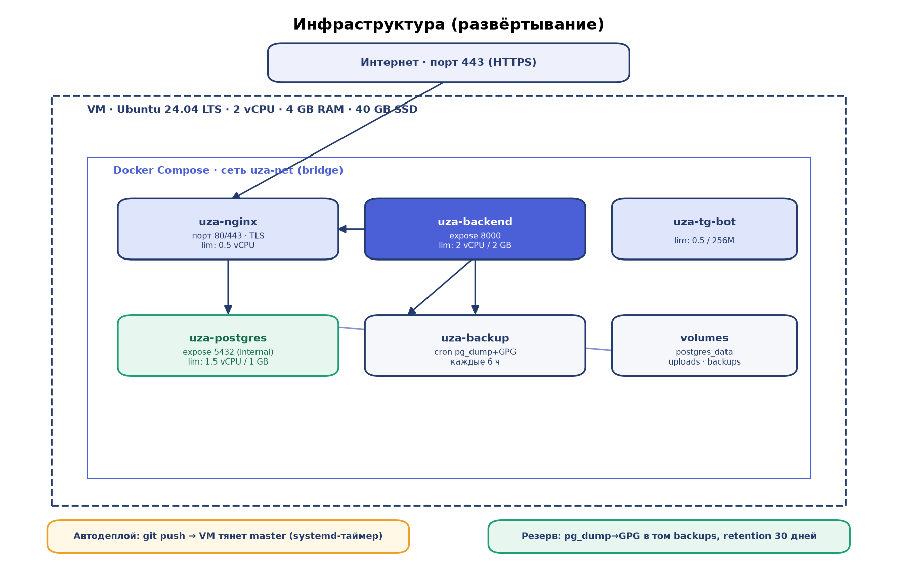

# Инфраструктура

## Схема развёртывания



Одна виртуальная машина, весь стек в Docker Compose (сеть `uza-net`). Наружу
опубликован только nginx (80/443). Backend, PostgreSQL, бот и backup-воркер — во
внутренней сети без публикации портов на хост.

## Контейнеры и образы

| Контейнер | Образ | Публикация | Лимиты (compose) |
|---|---|---|---|
| `uza-nginx` | nginx 1.27-alpine (+ собранная статика) | 80, 443 | 0.5 vCPU |
| `uza-backend` | Python 3.12-slim (FastAPI) | expose 8000 (внутр.) | 2 vCPU / 2 GB |
| `uza-postgres` | postgres:16-alpine | expose 5432 (внутр.) | 1.5 vCPU / 1 GB |
| `uza-tg-bot` | Python (aiogram) | — | 0.5 vCPU / 256 MB |
| `uza-backup` | alpine + postgresql-client + gnupg | — | — |

Backend монтирует код read-only (`:ro`) — процесс в контейнере не может переписать
`/app` (защита от инъекции кода); запись только в тома `uploads` и `certs`.
Контейнеры запускаются с `no-new-privileges` и `cap_drop: ALL` (nginx добавляет
только `NET_BIND_SERVICE` для портов <1024).

## Параметры сервера (текущий прод)

| Параметр | Значение |
|---|---|
| ОС | Ubuntu 24.04 LTS |
| CPU | 2 vCPU |
| RAM | ~4 GB |
| Диск | ~40 GB SSD |
| Размещение БД/приложения | внутренняя сеть, наружу — только nginx (443) |

Требования к слою (ориентировочно, для среды): сервер СУБД — 2 vCPU / 4 GB, SSD с
резервированием; сервер приложений — 2 vCPU / 2 GB; обратный прокси — 0.5 vCPU;
электропитание с UPS; исходящий доступ к внешним ИС и GitHub (для автодеплоя).

## Текущая нагрузка

Снимок (типичное состояние):

| Метрика | Значение |
|---|---|
| Load average (1/5/15 мин) | ~0.10 (при 2 vCPU — запас значительный) |
| RAM использовано | ~1.6 GB из ~4 GB (доступно ~2.3 GB) |
| Диск | ~66% занято |
| CPU по контейнерам | backend ~0.2%, postgres ~0.1%, bot ~0.2%, nginx ~0% (в покое) |
| RAM по контейнерам | backend ~340 MB, postgres ~250 MB, bot ~160 MB, nginx ~9 MB |

Как снять актуальные метрики — см. RUNBOOK.md → «Наблюдаемость».

## Планирование мощностей

Проектные показатели: 22 предприятия (с расширением), **перспектива ~300+
зарегистрированных пользователей** (оценка пикового одновременного онлайна —
~30–60, т.е. 10–20% от базы), время отклика ≤10 с, доступность ≥97%.

Текущая утилизация (load ~0.1 при 2 vCPU, RAM ~40%) показывает большой запас на
типовой нагрузке. Оценка под целевые 300+ пользователей:

| Профиль | Регистр. / пик онлайн | Рекомендуемая конфигурация |
|---|---|---|
| Текущий | десятки / единицы | 2 vCPU / 4 GB (достаточно) |
| Целевой | 300+ / ~30–60 | **4 vCPU / 8 GB**, 4 Uvicorn-воркера, тюнинг PostgreSQL |
| Резерв роста | 500+ / ~100 | 6–8 vCPU / 16 GB либо горизонтальное масштабирование |

Под 300+ пользователей ключевое — не «железо» (нагрузка на аналитическом
приложении невысокая), а: (1) несколько backend-воркеров вместо dev-режима с
`--reload`; (2) пул соединений и базовый тюнинг PostgreSQL; (3) контроль p95 и
диска. Приложение stateless — при необходимости масштабируется горизонтально.

Рекомендации по росту:

- **Вертикально:** для целевых 300+ пользователей — **4 vCPU / 8 GB**; поднять
  `cpus`/`memory` лимиты backend (до 3–4 vCPU / 4 GB) и postgres (2 vCPU / 2 GB)
  в `docker-compose.yml`.
- **Диск:** держать <75%; основной рост — `postgres_data` и `backups`. При
  приближении к лимиту увеличить том/диск, проверить retention бэкапов (30 дней).
- **Backend-воркеры:** для прод переопределить команду на несколько Uvicorn-воркеров
  (`COMPOSE_BACKEND_CMD='uvicorn app.main:app --host 0.0.0.0 --port 8000 --workers 4
  --proxy-headers --forwarded-allow-ips=172.16.0.0/12'`), убрав `--reload`.
- **БД:** при росте объёма — тюнинг PostgreSQL (`shared_buffers`, `work_mem`,
  пул соединений), контроль медленных запросов; вынести БД на отдельный узел.
- **Масштаб:** при необходимости — реплика PostgreSQL для чтения и несколько
  реплик backend за nginx (stateless-приложение это допускает).

Ключевые точки контроля: доля 5xx, время отклика p95, глубина очереди уведомлений
(outbox), лаг/ошибки интеграционных обменов, свободное место на диске.

## Развёртывание в Kubernetes (перспектива масштабирования)

Текущий прод — Docker Compose на одной VM. Для масштабирования под 300+
пользователей приложение переносится в Kubernetes без изменения кода (backend,
nginx и бот — stateless). Соответствие компонентов:

| Compose | Kubernetes |
|---|---|
| `uza-nginx` | Deployment + Service; предпочтительно Ingress-контроллер (TLS через cert-manager) |
| `uza-backend` | Deployment (2–4 реплики) + Service + HPA |
| `uza-tg-bot` | Deployment (1 реплика — воркер очереди, без масштабирования) |
| `uza-postgres` | StatefulSet + PVC, **или** внешняя управляемая БД (рекомендуется) |
| `uza-backup` | CronJob (`pg_dump` → GPG → объектное хранилище) |
| `.env` / ключи | Secret; неконфиденциальные параметры — ConfigMap |
| тома `uploads` | PVC (ReadWriteMany) или объектное хранилище (S3-совместимое) |

Ресурсы контейнеров (requests / limits) под целевые 300+ пользователей:

| Компонент | requests (cpu/mem) | limits (cpu/mem) | Реплики |
|---|---|---|---|
| backend | 500m / 512Mi | 1500m / 1.5Gi | 2–4 (HPA) |
| nginx / ingress | 100m / 128Mi | 500m / 256Mi | 2 |
| bot | 100m / 128Mi | 300m / 256Mi | 1 |
| postgres (StatefulSet) | 500m / 1Gi | 2000m / 2Gi | 1 (+реплика чтения при росте) |

Нагрузка и автомасштабирование:

- **HPA** для backend по CPU (target ~65%) и/или по кастомной метрике (RPS,
  p95): при 300+ пользователях (пик ~30–60 онлайн) — 2–4 пода backend;
  в спокойном режиме — 2. Каждый под — 1 Uvicorn-процесс (или несколько воркеров).
- **Суммарная нагрузка кластера** под целевой профиль (ориентир):
  ~2–4 vCPU и ~3–5 GiB RAM на прикладные поды (backend×2–4 + nginx×2 + bot),
  плюс БД (2 vCPU / 2 GiB). Итого узел(ы) кластера — **не менее 6 vCPU / 8 GiB**
  с запасом на системные компоненты k8s (kubelet, ingress, мониторинг).
- **БД в k8s** держать на StatefulSet с быстрым PVC (SSD) либо вынести во внешнюю
  управляемую PostgreSQL — на 300+ пользователей это снимает главный риск
  состояния и упрощает бэкап/реплики.
- **PodDisruptionBudget** и `readiness/liveness`-пробы (backend: `/api/health`,
  nginx: `/__nginx_health__`) для безотказных выкатов и rolling-update.
- **Ingress**: TLS (cert-manager/Let's Encrypt или корпоративный CA), лимиты тела
  запроса (как в текущем nginx), сжатие; WebSocket для реалтайм-уведомлений.

Отдельного брокера очередей заводить не требуется — `telegram_outbox` и
модерация реализованы таблицами PostgreSQL; бот-под опрашивает очередь. Это же
упрощает k8s-топологию (нет StatefulSet под брокер).

## Автодеплой

`master` разворачивается автоматически: VM тянет `origin/master` по systemd-таймеру
(`ops/vm-autodeploy/`, установка один раз через `install.sh`). Скрипт `deploy.sh`
идемпотентен: при новом коммите делает `git reset --hard origin/master`, пересобирает
образ nginx (в него запечён фронт) и перезапускает backend (backend монтирует код,
runtime-миграции применяются при старте). Ключ `jwt_public.pem` сохраняется поверх
reset (окруженческий).

Порядок: `git push origin master` → в течение ~2 минут изменения на проде.

## Резервное копирование

Backup-воркер по расписанию (по умолчанию каждые 6 часов) делает `pg_dump` → gzip →
шифрование GPG → SHA-256-манифест, складывает в том `backups`, retention 30 дней.
Без указанного получателя GPG (`BACKUP_GPG_RECIPIENT`) воркер намеренно отказывается
писать незашифрованный архив. Восстановление — см. RUNBOOK.md.

## Клон базы данных

Снять полный дамп БД (схема + данные) из контейнера PostgreSQL:

```bash
# логический дамп (custom-формат, сжатый) — рекомендуется
docker exec -t uza-postgres pg_dump -U uza -d uzassets -Fc -f /tmp/uzassets.dump
docker cp uza-postgres:/tmp/uzassets.dump ./uzassets.dump

# или plain SQL
docker exec -t uza-postgres pg_dump -U uza -d uzassets > uzassets.sql

# только схема (без данных)
docker exec -t uza-postgres pg_dump -U uza -d uzassets --schema-only > schema.sql
```

Восстановить в чистую БД:

```bash
# из custom-дампа
docker cp ./uzassets.dump uza-postgres:/tmp/uzassets.dump
docker exec -t uza-postgres pg_restore -U uza -d uzassets --clean --if-exists /tmp/uzassets.dump

# из plain SQL (через stdin, чтобы не терять кириллицу)
cat uzassets.sql | docker exec -i uza-postgres psql -U uza -d uzassets
```

Примечание: при переносе на другую среду пароль владельца БД и окруженческие ключи
(`jwt_public.pem` и др.) задаются заново под целевое окружение.
