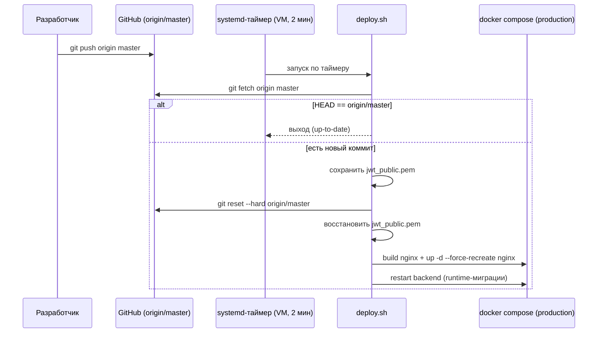

# Инфраструктура

> Снимок кода: коммит `c9f29f3`, ветка `master`. Дата снимка: 2026-07-21.
> Ветки: `master` (прод) и `feat/financials-ux-overhaul` (фича-ветка); `origin` — GitHub.
> Файл оркестрации: `backend/docker-compose.yml` (запускается из корня репозитория с
> `--project-directory .`). Текущее состояние — **одна VM + Docker Compose**, без Kubernetes.

## Схема развёртывания


Весь стек живёт на одной виртуальной машине в Docker Compose (bridge-сеть `uza-net`).
Наружу опубликован только nginx (порты 80/443). Backend, PostgreSQL, Telegram-бот и
backup-воркер работают во внутренней сети без публикации портов на хост.

```mermaid
flowchart TB
    subgraph Internet["Интернет"]
        User["Пользователи (браузер)"]
        TG["Telegram (Bot API, long-poll)"]
        GH["GitHub (origin/master)"]
    end

    subgraph VM["Прод-VM 89.126.221.64 · Ubuntu 24.04 · 2 vCPU · 3.8 GiB RAM · диск 38 GB"]
        subgraph net["Docker-сеть uza-net (bridge)"]
            NG["uza-nginx&#10;nginx 1.27-alpine&#10;+ запечённый фронт (Vue) + TWA&#10;порты 80/443"]
            BE["uza-backend&#10;FastAPI / uvicorn&#10;expose 8000 (внутр.)&#10;код :ro, runtime-миграции"]
            PG[("uza-postgres&#10;postgres:16-alpine&#10;expose 5432 (внутр.)&#10;том postgres_data")]
            BOT["uza-tg-bot&#10;aiogram, outbox-воркер&#10;polling очереди telegram_outbox"]
            BK["uza-backup&#10;pg_dump → gzip → GPG&#10;cron, том backups"]
        end
        TIMER["systemd-таймер&#10;uza-autodeploy.timer (каждые 2 мин)&#10;→ deploy.sh"]
    end

    User -- "HTTPS 443" --> NG
    NG -- "/api/ → 8000" --> BE
    NG -- "/ (SPA), /twa/" --> NG
    BE <--> PG
    BOT <--> PG
    BOT <--> TG
    BK --> PG
    TIMER -- "git pull" --> GH
    TIMER -- "build nginx / restart backend" --> net
```



## Профили Docker Compose

Файл `backend/docker-compose.yml` определяет два профиля:

| Профиль | Состав | Назначение |
|---|---|---|
| default (dev) | `postgres` + `backend` | локальная разработка; backend с `--reload`, фронт поднимается отдельным `vite` dev-сервером (5173), backend на 8000 |
| `production` | `+ nginx` (TLS-edge с запечённым фронтом) `+ backup` | полный прод-стек |

Запуск:

```bash
# dev
docker compose -f backend/docker-compose.yml up -d --build
# полный прод-стек (из корня репозитория)
docker compose --project-directory . -f backend/docker-compose.yml \
  --profile production up -d --build
```

Примечание: отдельного контейнера `uza-frontend` больше нет — Vue-бандл и
Telegram Mini App (TWA) собираются **внутри образа nginx** многоступенчатым
Dockerfile (stage 1 = `node:20` + `vite build`, stage 2 = nginx со статикой).
Это экономит один контейнер (~250 MB RAM) и один сетевой хоп. Заголовок-комментарий
в compose про «default … + frontend (5173)» устарел: сервиса `frontend` в файле нет.

## Контейнеры и образы

| Контейнер | Образ | Публикация | Лимиты (compose `deploy.resources`) |
|---|---|---|---|
| `uza-nginx` | nginx 1.27-alpine (+ запечённый фронт + TWA) | 80, 443 | без явных лимитов |
| `uza-backend` | Python-slim (FastAPI/uvicorn) | expose 8000 (внутр.) | 2 vCPU / 2 GB (резерв 0.5 / 512M) |
| `uza-postgres` | postgres:16-alpine | expose 5432 (внутр.) | 1.5 vCPU / 1 GB (резерв 0.25 / 256M), переопределяемо `POSTGRES_CPU_LIMIT`/`POSTGRES_MEM_LIMIT` |
| `uza-tg-bot` | Python (aiogram) | — | 0.5 vCPU / 256 MB (резерв 0.1 / 64M) |
| `uza-backup` | alpine + postgresql-client + gnupg + dcron | — | без явных лимитов (`init: true`, tini как PID 1) |

Тома (все `driver: local`): `postgres_data`, `backend_uploads`, `nginx_logs`,
`backups`, `backup_gpg` (keyring GPG-получателя).

Безопасность контейнеров:
- Backend монтирует код read-only (`./backend:/app:ro`, `./backend/keys:/app/keys:ro`)
  — процесс в контейнере не может переписать `/app` (защита от persistent
  code-injection / web-shell). Хост-side `git pull` + restart по-прежнему работают.
  Запись — только в тома `backend_uploads` и общий с nginx `./nginx/certs`.
- `no-new-privileges: true` и `cap_drop: ALL` на backend и bot; nginx добавляет
  `NET_BIND_SERVICE` (порты <1024) плюс `CHOWN/SETUID/SETGID/DAC_OVERRIDE`.
- `uza-backup` намеренно **без** `no-new-privileges` — `dcron`/`crond` требует
  `setpgid`, иначе контейнер уходит в краш-луп.
- PostgreSQL слушает только внутреннюю Docker-сеть, порт 5432 на хост не публикуется.
- Runtime-подключение backend идёт под ролью наименьших привилегий `uza_app`
  (DML по всем таблицам, но без DDL и без UPDATE/DELETE по `audit_log`); суперюзер
  `uza` зарезервирован под Alembic-миграции (`DATABASE_URL_ADMIN`).

## Асинхронность и очереди (без внешнего брокера)

Выделенного брокера сообщений (Redis / RabbitMQ / Celery / Kafka) в системе **нет**.
Асинхронная обработка построена на трёх механизмах:

- **FastAPI BackgroundTasks** — короткие фоновые задачи в рамках процесса backend.
- **PostgreSQL как очередь** — таблица `telegram_outbox` (исходящие уведомления) и
  таблицы модерации играют роль durable-очереди; `uza-tg-bot` опрашивает outbox
  (`OUTBOX_POLL_SEC=2.0`, батч `OUTBOX_BATCH_SIZE=10`, ретраи `OUTBOX_MAX_RETRIES=5`).
- **systemd-таймеры на VM** — периодические задачи уровня хоста (в частности
  автодеплой; см. ниже). Внутри контейнера бэкапа — `dcron`.
- **Telegram polling** — бот работает в режиме long-poll к Bot API (без webhook-инфраструктуры).

Такая модель упрощает топологию: нет отдельного stateful-сервиса под брокер.

## Параметры сервера (текущий прод, замер 2026-07-21)

| Параметр | Значение |
|---|---|
| Адрес | 89.126.221.64 |
| ОС | Ubuntu 24.04.4 LTS |
| Ядро | 6.8.0-124-generic |
| CPU | 2 vCPU |
| RAM | 3.8 GiB (swap 0 B) |
| Диск | 38 GB, использовано 27 GB (70%), свободно 12 GB |
| Uptime | ~26 дней |

Ориентир требований к слою (для развёртывания в новой среде): сервер СУБД —
2 vCPU / 4 GB, SSD с резервированием; сервер приложений — 2 vCPU / 2 GB; обратный
прокси — 0.5 vCPU; UPS; исходящий доступ к внешним ИС и GitHub (для автодеплоя).

## Текущая нагрузка

Снимок метрик хоста (замер 2026-07-21, 11:30 UTC):

| Метрика | Значение |
|---|---|
| Load average (1 / 5 / 15 мин) | 0.20 / 0.23 / 0.27 (на 2 ядра ≈ 10%) |
| RAM использовано | 1.5 GiB |
| RAM buff/cache | 1.0 GiB |
| RAM доступно | 2.3 GiB |
| Swap | 0 B (не сконфигурирован) |
| Диск | 70% занято (27 из 38 GB) |

Как снять актуальные метрики (`uptime`, `free -h`, `df -h`, `docker stats`) —
см. RUNBOOK.md → «Наблюдаемость».

## Планирование мощностей

Проектные показатели: 22 предприятия (с расширением), перспектива ~300+
зарегистрированных пользователей (оценка пикового одновременного онлайна — ~30–60,
т.е. 10–20% от базы), время отклика ≤10 с, доступность ≥97%.

Вывод из текущей утилизации: при load ~0.2 на 2 vCPU и активно используемых ~1.5 GiB
RAM запас по CPU значительный. Приложение аналитическое, профиль нагрузки невысокий.
Узкие места — не процессор, а два ресурса:

1. **RAM 3.8 GiB без swap.** Пиковое потребление (backend 2 GB-лимит + postgres 1 GB
   + bot 256 MB + nginx + система) при всплеске может упереться в потолок, а отсутствие
   swap делает исход жёстким (OOM-kill вместо деградации). Это первый кандидат на риск.
2. **Диск 70%.** Основной рост — `postgres_data`, `backups` (retention 30 дней) и
   `nginx_logs`. При приближении к 80–85% — риск отказа записи БД/бэкапов.

Оценка под целевые 300+ пользователей:

| Профиль | Регистр. / пик онлайн | Рекомендуемая конфигурация |
|---|---|---|
| Текущий | десятки / единицы | 2 vCPU / 3.8 GiB (CPU с запасом; RAM/диск — под контролем) |
| Целевой | 300+ / ~30–60 | 4 vCPU / 8 GiB, 4 Uvicorn-воркера, тюнинг PostgreSQL |
| Резерв роста | 500+ / ~100 | 6–8 vCPU / 16 GiB либо горизонтальное масштабирование |

Рекомендации (в порядке приоритета для текущего сервера):

- **RAM и swap:** первоочередно — включить swap (2–4 GiB) как страховку от OOM;
  при переходе к целевому профилю — вертикально до 8 GiB. Лимиты backend/postgres
  в `deploy.resources` тогда поднять (backend до 3–4 vCPU / 4 GB, postgres до 2 vCPU / 2 GB).
- **Диск и ротация:** держать <75%. Настроить ротацию `nginx_logs` (logrotate или
  Docker `max-size`/`max-file`), проверять retention бэкапов (`BACKUP_RETENTION_DAYS=30`),
  при приближении к лимиту — увеличить том/диск. Рост `postgres_data` контролировать
  через `VACUUM`/мониторинг размеров таблиц.
- **Backend-воркеры:** для прод переопределить команду на несколько Uvicorn-воркеров,
  убрав `--reload`:
  `COMPOSE_BACKEND_CMD='uvicorn app.main:app --host 0.0.0.0 --port 8000 --workers 4 --proxy-headers --forwarded-allow-ips=172.16.0.0/12'`.
- **Вертикальное масштабирование VM:** для целевых 300+ — 4 vCPU / 8 GiB.
- **Вынос PostgreSQL:** при росте объёма/нагрузки — вынести БД на отдельный узел
  (или управляемую PostgreSQL); это снимает главный риск состояния, освобождает RAM
  на прикладном узле и упрощает бэкап/реплики. При необходимости — реплика чтения.
- **Тюнинг PostgreSQL:** `shared_buffers`, `work_mem`, пул соединений, контроль
  медленных запросов.

Приложение stateless (backend, nginx, бот) — при необходимости масштабируется
горизонтально без изменения кода.

Ключевые точки контроля: доля 5xx, время отклика p95, глубина очереди уведомлений
(`telegram_outbox`), лаг/ошибки интеграционных обменов, свободное место на диске, swap-usage.

## Автодеплой (pull-based)

`master` разворачивается автоматически по **pull-модели**: VM сама тянет
`origin/master` по systemd-таймеру. Причина — входящий SSH (порт 22) на VM
периодически режется фаерволом (пакеты дропаются), что блокирует push-деплой;
исходящий доступ к `github.com:443` работает, поэтому VM забирает изменения сама.
Скрипты — в `ops/vm-autodeploy/`.

- `uza-autodeploy.timer` — `OnBootSec=1min`, `OnUnitActiveSec=2min` (проверка каждые
  ~2 минуты), `AccuracySec=15s`.
- `uza-autodeploy.service` → запускает `deploy.sh`.
- `install.sh` — разовая установка юнитов (через консоль VM).
- `deploy.sh` (идемпотентен):
  1. сохраняет окруженческий `backend/jwt_public.pem` в `/tmp` (иначе `git reset`
     затрёт его → «Signature verification failed» → выброс на логин после MFA);
  2. `git fetch`; если `HEAD == origin/master` — выходит без пересборки;
  3. иначе `git reset --hard origin/master`, восстанавливает `jwt_public.pem`;
  4. `dc build nginx` (в образ nginx запечён фронт) + `dc up -d --force-recreate nginx`;
  5. `dc restart backend` (runtime-миграции + сиды применяются при старте).
  Где `dc()` = `docker compose --project-directory . -f backend/docker-compose.yml --profile production`.

Порядок для разработчика: `git push origin master` → в течение ~2 минут изменения на проде.

Схема автодеплоя:



## Резервное копирование

Контейнер `uza-backup` по расписанию (`BACKUP_SCHEDULE`, по умолчанию `0 */6 * * *`
— каждые 6 часов; RPO = частота копий) выполняет `pg_dump` → gzip → шифрование GPG →
SHA-256-манифест, складывает архивы в том `backups`, retention `BACKUP_RETENTION_DAYS=30`.
При `BACKUP_REQUIRE_ENCRYPTION=true` (по умолчанию) и без указанного получателя GPG
(`BACKUP_GPG_RECIPIENT`, публичный ключ в keyring-томе `backup_gpg`) воркер намеренно
отказывается писать незашифрованный архив. Часовой пояс — `TZ=Asia/Tashkent`.
Восстановление — см. RUNBOOK.md.

Стандарты: O'zMSt 149 п.4.8 / 841 5.6.1 / ISO 27040 (шифрование at-rest).

## Клон базы данных

БД содержит 141 таблицу в схеме `public`. Клон-дамп передаётся разработчикам
**вне git** (содержит реальные данные и не хранится в репозитории); принятое имя
и формат — `database/uzassets.dump`, PostgreSQL custom-формат (`-Fc`, сжатый).

Снять полный дамп из контейнера PostgreSQL:

```bash
# логический дамп (custom-формат, сжатый) — рекомендуется
docker exec -t uza-postgres pg_dump -U uza -d uzassets -Fc -f /tmp/uzassets.dump
docker cp uza-postgres:/tmp/uzassets.dump ./database/uzassets.dump

# или plain SQL
docker exec -t uza-postgres pg_dump -U uza -d uzassets > uzassets.sql

# только схема (без данных)
docker exec -t uza-postgres pg_dump -U uza -d uzassets --schema-only > schema.sql
```

Восстановить в чистую БД:

```bash
# из custom-дампа
docker cp ./database/uzassets.dump uza-postgres:/tmp/uzassets.dump
docker exec -t uza-postgres pg_restore -U uza -d uzassets --clean --if-exists /tmp/uzassets.dump

# из plain SQL (через stdin — надёжнее для кириллицы, чем PowerShell-пайп)
cat uzassets.sql | docker exec -i uza-postgres psql -U uza -d uzassets
```

Примечание: при переносе на другую среду пароль владельца БД и окруженческие ключи
(`jwt_public.pem`, `jwt_private.pem`, `fernet.key`, `audit_hmac.key`) задаются заново
под целевое окружение.

## Развёртывание в Kubernetes (опция масштабирования, не текущее состояние)

> **Текущий прод — Docker Compose на одной VM. Kubernetes не используется.**
> Раздел ниже — проработанная опция на будущее, для роста под 300+ пользователей.

Приложение переносится в Kubernetes без изменения кода (backend, nginx и бот —
stateless). Соответствие компонентов:

| Compose | Kubernetes |
|---|---|
| `uza-nginx` | Deployment + Service; предпочтительно Ingress-контроллер (TLS через cert-manager) |
| `uza-backend` | Deployment (2–4 реплики) + Service + HPA |
| `uza-tg-bot` | Deployment (1 реплика — воркер очереди, без масштабирования) |
| `uza-postgres` | StatefulSet + PVC, **или** внешняя управляемая БД (рекомендуется) |
| `uza-backup` | CronJob (`pg_dump` → GPG → объектное хранилище) |
| `.env` / ключи | Secret; неконфиденциальные параметры — ConfigMap |
| том `backend_uploads` | PVC (ReadWriteMany) или объектное хранилище (S3-совместимое) |

Ресурсы контейнеров (requests / limits) под целевые 300+ пользователей:

| Компонент | requests (cpu/mem) | limits (cpu/mem) | Реплики |
|---|---|---|---|
| backend | 500m / 512Mi | 1500m / 1.5Gi | 2–4 (HPA) |
| nginx / ingress | 100m / 128Mi | 500m / 256Mi | 2 |
| bot | 100m / 128Mi | 300m / 256Mi | 1 |
| postgres (StatefulSet) | 500m / 1Gi | 2000m / 2Gi | 1 (+реплика чтения при росте) |

Нагрузка и автомасштабирование:

- **HPA** для backend по CPU (target ~65%) и/или кастомной метрике (RPS, p95):
  при пике ~30–60 онлайн — 2–4 пода backend; в спокойном режиме — 2.
- **Суммарная нагрузка кластера** под целевой профиль (ориентир): ~2–4 vCPU и
  ~3–5 GiB RAM на прикладные поды (backend×2–4 + nginx×2 + bot), плюс БД (2 vCPU / 2 GiB).
  Итого узел(ы) кластера — не менее 6 vCPU / 8 GiB с запасом на системные компоненты k8s.
- **БД в k8s** — StatefulSet с быстрым PVC (SSD) либо внешняя управляемая PostgreSQL
  (снимает главный риск состояния, упрощает бэкап/реплики).
- **PodDisruptionBudget** и `readiness/liveness`-пробы (backend: `/api/health`,
  nginx: `/__nginx_health__`) для безотказных rolling-update.
- **Ingress**: TLS (cert-manager/Let's Encrypt или корпоративный CA), лимит тела
  запроса (как в текущем nginx: `REQUEST_BODY_MAX_BYTES=26214400` ≈ 25 MB), сжатие,
  WebSocket для реалтайм-уведомлений.

Отдельного брокера очередей заводить не требуется — `telegram_outbox` и модерация
реализованы таблицами PostgreSQL, бот-под опрашивает очередь. Это упрощает
k8s-топологию (нет StatefulSet под брокер).

## Прикладные изменения с прошлого снимка (2026-07-20 → c9f29f3)

Топология инфраструктуры не менялась; для полноты — прикладные изменения этого снимка,
затрагивающие эксплуатацию:

- **RBAC-упрочнение (безопасность):** privilege-ceiling на всех путях выдачи прав/ролей
  (`upsert_user_membership`, `set_group_members`, `create_user`, `update_user`,
  `set_group_permissions`, `create_role`, `update_role_permissions`) — закрыта
  вертикальная (нельзя получить `admin`/`admin.*`) и горизонтальная (per-company/sector
  scope) самоэскалация scoped-админа; helpers `_ensure_group_membership_within_ceiling` /
  `_ensure_assigned_scope_within_ceiling`. AI-чат не 400-ит на Opus-моделях
  (temperature 400-heal в `stream_chat_with_tools`). `PATCH /me` self-set
  `organization_id` — валидация существования компании + аудит-запись.
- **Честность метрик:** forensic «план утверждён» — единый предикат; governance
  KPI-комитеты по факту заседаний; живой курс USD в обзоре (`year_registry`);
  Debt/EBITDA «—» вместо ложного `0.00×`; credit EL — maturity-proxy для просрочки.
- **Удаление мёртвого кода:** локальные Vue-модули FinModel, Credit Portfolio,
  Invest Projects (роуты теперь render-null-заглушки с прежним внешним редиректом на
  `dashboard.uz-assets.uz`), FinModelUapV1, ExecDash-блоки credit/econ, скрытые UI-блоки.
  Backend `credit_scenario` и `invest_projects` — **живые** (потребляются
  `CreditNagruzkaTab` в `/system-config` и ExecDash), не удалены.
- **Модуль «Производственные показатели»** — вкладка Бизнес-плана, хранение JSONB
  snapshot (`raw_snapshot.productionData`).

Эти изменения — уровня приложения/БД (runtime-миграции применяются при рестарте
backend); процедуры развёртывания, бэкапа и автодеплоя они не меняют.
