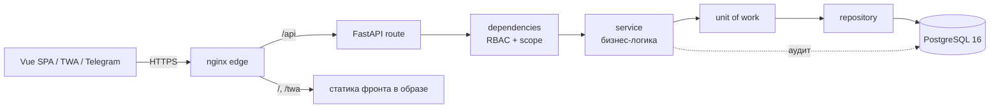

# Единая платформа трансформации — техническая документация

Веб-платформа мониторинга финансово-хозяйственной деятельности и трансформации
22 государственных предприятий Узбекистана: сбор и онлайн-анализ финансовой
отчётности (МСФО/НСБУ), исполнения бизнес-планов и КПЭ, кредитного портфеля,
инвестпроектов, производственных показателей и удельной себестоимости, закупок,
рейтингов, ESG и корпоративного управления, портфеля проектов и задач. Ролевой
доступ (RBAC с per-company/sector scope), модерация изменений, журнал аудита,
ИИ-ассистент и Telegram-уведомления.

> Снимок кода: коммит **c9f29f3**, ветка **master**, дата **2026-07-21**.
> Прод-ветка — `master`; активная фича-ветка — `feat/financials-ux-overhaul`.
> `origin` — на GitHub.

## Состав документации

| Документ | Содержание |
|---|---|
| [ARCHITECTURE.md](ARCHITECTURE.md) | C4-модель (контекст/контейнеры/компоненты), стратегия ветвления, технологии, список интеграций клиент↔сервер и внешних систем |
| [INFRASTRUCTURE.md](INFRASTRUCTURE.md) | Схема развёртывания, Docker, параметры серверов, текущая нагрузка, планирование мощностей, клон БД |
| [DATABASE.md](DATABASE.md) | Схема БД (домены), фоновая обработка, миграции |
| [COMPLIANCE.md](COMPLIANCE.md) | Соответствие стандартам кибербезопасности РУз (O'z DSt / O'zMSt), карта мер и открытые пункты |
| [RUNBOOK.md](RUNBOOK.md) | Эксплуатация: деплой, резервное копирование/восстановление, инциденты, типовые операции |
| [SNAPSHOT.md](SNAPSHOT.md) | Порядок формирования передаваемого снимка кода |
| [diagrams/](diagrams/) | PNG-схемы (C4-контекст, C4-контейнеры, инфраструктура) |

## Структура репозитория

```
backend/          FastAPI-приложение (Python 3.12)
  app/
    api/routes/   REST-роутеры (~71 модуль, тонкий HTTP-слой)
    services/     бизнес-логика (~67 доменных пакетов)
    repositories/ доступ к данным (SQLAlchemy, async)
    models/       ORM-модели (~50 модулей)
    schemas/      Pydantic-схемы (валидация/сериализация)
    core/         безопасность, конфиг, runtime-миграции, наблюдаемость
    uow/          Unit of Work
  alembic/        версионные миграции (~72 ревизии)
  scripts/        init.sql, setup-db-users.*, backup/
  docker-compose.yml
  Dockerfile      (python:3.12-slim)
  .env.example    шаблон конфигурации
frontend/         SPA (Vue 3.5 + TypeScript + Vite 5 + Pinia + vue-router)
frontend-twa/     Telegram Mini App (Vue 3)
bot/              Telegram бот-воркер (aiogram, outbox-поллинг)
nginx/            reverse proxy + multi-stage сборка фронта и TWA в образ
ops/vm-autodeploy/ pull-based автодеплой (systemd service + timer)
docs/             документация (в т.ч. docs/handoff, docs/integration)
scripts/, sdk/    вспомогательные утилиты
database/         клон БД (uzassets.dump, PostgreSQL custom -Fc)
```

## Требования

- **Docker** + **Docker Compose** (v2) — единственное обязательное требование для запуска.
- **PostgreSQL 16** — поставляется контейнером `postgres:16-alpine`, отдельная установка не нужна.
- **Node 20** — нужен только для сборки фронта; выполняется автоматически внутри
  multi-stage образа nginx (`node:20-alpine` → `vite build` → `nginx:1.27-alpine`).
  Локально Node требуется лишь для запуска dev-сервера Vite (`npm run dev`).
- Ключи (генерируются один раз перед запуском): пара RS256 для JWT
  (`jwt_private.pem` / `jwt_public.pem`), ключ Fernet (`fernet.key`),
  HMAC-секрет аудита (`audit_hmac.key`) — в каталоге `backend/keys/`.
  `jwt_public.pem` — окружение-специфичный, **не коммитится**.

## Быстрый старт (локально)

```bash
git clone <repo-url> uzassets-platform
cd uzassets-platform/backend
cp .env.example .env            # заполнить POSTGRES_PASSWORD и др. (см. .env.example)
# сгенерировать ключи в backend/keys/: RS256-пара JWT, fernet.key, audit_hmac.key
#   (порядок и команды — RUNBOOK.md → «Ключи»)

# dev-профиль: postgres + backend + telegram-бот (5432 внутренний, 8000 backend)
docker compose up -d --build
```

Полный (production) стек — добавляет nginx (TLS-edge с запечённым фронтом и TWA)
и сервис резервного копирования. Собирается из корня репозитория с
`--project-directory .`, потому что nginx-образ строит фронт из контекста корня:

```bash
docker compose --project-directory . -f backend/docker-compose.yml \
  --profile production up -d --build
```

### Профили и порты

| Профиль | Сервисы (`container_name`) | Публикуемые порты |
|---|---|---|
| default (dev) | `uza-postgres`, `uza-backend`, `uza-tg-bot` | нет (backend 8000 и postgres 5432 — только во внутренней сети `uza-net`; для отладки backend раскомментировать блок `ports`) |
| production | + `uza-nginx`, `uza-backup` | `80`, `443` (только nginx) |

Внешний доступ идёт **только через nginx**: SPA — `https://<host>/`, API —
`https://<host>/api/`, Telegram Mini App — `/twa/`. Интерактивная документация API
(Swagger/ReDoc) доступна на `/api/docs` при `ENABLE_DOCS_IN_PRODUCTION=true`
и `API_ROOT_PATH=/api`.

### Схема БД, миграции и первый вход

- **Схема применяется двумя путями**: версионные миграции Alembic
  (`backend/alembic/versions/`, ~72 ревизии) и идемпотентные runtime-миграции —
  self-healing `ADD COLUMN`/DDL, выполняемые при старте backend
  (`app/core/runtime_migrations*.py`, вызов в `lifespan`). Runtime-путь позволяет
  катить схему через простой `restart backend` без отдельного шага alembic.
- Для локальной работы «1 в 1» с продом можно восстановить клон
  `database/uzassets.dump` (`pg_restore`, PostgreSQL custom-формат `-Fc`),
  затем переприменить пароль владельца БД.
- Учётные данные: локальная аутентификация (username/email + пароль + JWT), без
  внешних IdP/SSO. Порядок создания первого администратора и сидов —
  см. RUNBOOK.md.

## Архитектура backend (10 слоёв)

Запрос проходит: **route → dependencies → service → unit of work → repository → БД**.
Роутеры тонкие (без прямого доступа к БД); бизнес-логика в сервисах; доступ к
данным — в репозиториях (async SQLAlchemy). Изменения данных выполняются в единой
транзакции вместе с записью в журнал аудита.



JWT — RS256, в header обязателен `kid` (`decode_token` отвергает токены без него).
RBAC — с privilege-ceiling на всех путях выдачи прав/ролей: закрыта вертикальная
(нельзя выдать себе `admin`/`admin.*`) и горизонтальная (per-company / per-sector
scope) самоэскалация scoped-администратора.

## Фоновая обработка (без внешнего брокера)

Выделенного брокера очередей (Redis / RabbitMQ / Celery) в стеке **нет**.
Асинхронность реализована тремя механизмами:

- **In-process планировщики и воркеры** внутри backend, запускаемые в `lifespan`
  (asyncio): рассылки (`broadcast_scheduler`), автозахват срезов прогресса
  (`snapshot_scheduler`), дедлайны (`deadline_scheduler`), доставка вебхуков
  (`webhook_worker`), авто-продление TLS (`tls_scheduler`). Точечно — `asyncio.create_task`
  для fire-and-forget внутри запроса.
- **Telegram-бот** (`uza-tg-bot`) — отдельный контейнер, поллит таблицу-outbox
  уведомлений в БД (`OUTBOX_POLL_SEC`, по умолчанию 2 c) и доставляет сообщения;
  он же обрабатывает MFA-привязку и callback'и.
- **systemd-таймер** на VM (`ops/vm-autodeploy/`) — pull-based деплой каждые 2 мин.

## Ключевые изменения снимка (относительно 2026-07-20)

1. **Упрочнение RBAC**: privilege-ceiling добавлен во все точки выдачи прав/ролей
   (`upsert_user_membership`, `set_group_members`, `create_user`, `update_user`,
   `set_group_permissions`, `create_role`, `update_role_permissions`) через хелперы
   `_ensure_group_membership_within_ceiling` / `_ensure_assigned_scope_within_ceiling`.
   `PATCH /me` для self-set `organization_id` — с валидацией существования компании
   и аудит-записью. ИИ-чат больше не падает 400 на моделях Opus
   (heal `temperature` в `stream_chat_with_tools`).
2. **Честность метрик**: единый предикат «план утверждён» в forensic (KPI = бейдж =
   фильтр); KPI-комитеты в governance считаются по факту (флаг И наличие заседаний);
   живой курс USD в обзоре берётся из `year_registry`, а не хардкода; Debt/EBITDA
   показывает «—» вместо ложного `0.00×`; credit EL использует maturity-proxy для просрочки.
3. **Удаление мёртвого кода**: удалён локальный Vue-код модулей «Финансовая модель»
   (FinModel/FinModelUapV1), «Кредитный портфель», «Инвест-проекты» — эти разделы и
   ранее лишь редиректили на внешний `dashboard.uz-assets.uz`; их роуты теперь
   render-null-заглушки с тем же внешним редиректом. Backend `credit_scenario` и
   `invest_projects` — **живые** (потребляются `CreditNagruzkaTab` в системной
   конфигурации и Execution Dashboard) и не удалялись. Также убраны блоки
   credit/econ в ExecDash, фабрикованная карточка «стандарты» и скрытые UI-блоки.
4. **Модуль «Производственные показатели»** — вкладка Бизнес-плана; хранение —
   JSONB-снимок (`raw_snapshot.productionData`), права `bp.*`, честный пересчёт
   темпа/исполнения в сервисе.

## Разделы платформы (навигация)

Проекты трансформации, Сводный обзор портфеля, Execution Summary, карточки
компаний и Библиотека, Доски/Проекты/Задачи (конструктор, календарь,
отслеживаемое), KPI, Финансы (НСБУ/МСФО-редакторы, SOE Health Check Tool,
Удельная себестоимость), Бизнес-план (в т.ч. Производственные показатели),
Консультанты, Корпоративное управление, ИИ-ассистент. Административные:
Управление доступом (RBAC), Модерация, Уведомления и рассылки, Безопасность,
Каталоги, Хранилище файлов, API & Интеграции, Системные константы, SMTP, БД, TLS.
Внешние (редирект): Финансовая модель, Кредитный портфель, Инвест-проекты.
