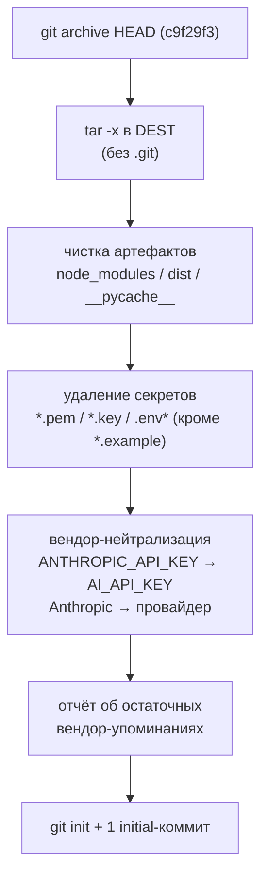

# Формирование передаваемого снимка кода

Передача разработчикам выполняется **чистым снимком без истории** — рабочий
репозиторий и продовый деплой при этом не затрагиваются.

**Снимок этой версии:** коммит `c9f29f3` (ветка `master`), дата — 2026-07-21.
Помимо `master` (прод) в репозитории есть фича-ветка `feat/financials-ux-overhaul`;
`origin` — на GitHub. В снимок попадает только текущее состояние `HEAD`.

## Что делает снимок

Скрипт [`scripts/make-clean-snapshot.sh`](../../scripts/make-clean-snapshot.sh):

1. экспортирует только отслеживаемые файлы текущего `HEAD` (`git archive HEAD`)
   в отдельную папку — **без `.git`**, значит без истории коммитов;
2. вычищает возможные артефакты (`node_modules`, `dist`, `__pycache__`) и секреты
   (`.pem`, `.key`, `.env`, `.env.*`) — примеры `.env*.example` остаются; сам скрипт
   снимка в передаваемый комплект не входит (внутренний инструмент, содержит
   вендор-слова в паттернах подстановки);
3. приводит имена к вендор-нейтральным: провайдер-специфичная переменная окружения
   `ANTHROPIC_API_KEY` → общий `AI_API_KEY` (с чисткой возникающей избыточной
   подстановки), упоминание `Anthropic` в комментариях → «провайдер»;
4. печатает отчёт об остаточных вендор-упоминаниях (`anthropic`, `claude`,
   `firebase`, `монолит`/`monolith`) для ручной проверки;
5. инициализирует свежий git с **одним** initial-коммитом
   («Initial commit: Единая платформа трансформации»).

## Поток формирования



## Запуск

```bash
bash scripts/make-clean-snapshot.sh [DEST_DIR]
# DEST_DIR по умолчанию: ../uzassets-platform-snapshot  (git-история = 1 коммит)

# упаковать в архив для передачи:
cd ..
tar -czf uzassets-platform-snapshot.tar.gz uzassets-platform-snapshot
```

## После передачи

Разработчики получают самодостаточный репозиторий с одним коммитом. Для запуска —
`docs/handoff/README.md` (быстрый старт) и `RUNBOOK.md` (ключи, эксплуатация).
Ключ ИИ, пароль БД и криптоключи задаются заново под их окружение (в снимке их нет).

## Примечание

Скрипт использует POSIX-инструменты (`git`, `tar`, `sed`, `grep`, `find`) — запускать
в bash-окружении (Linux/macOS/WSL/Git Bash).
